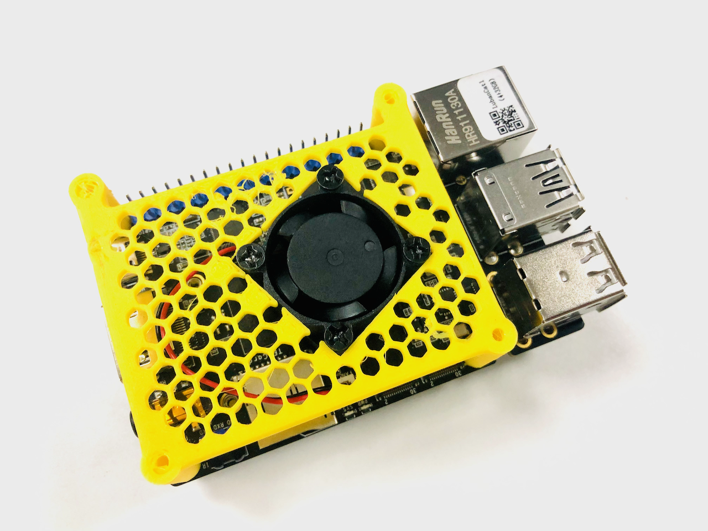

# lubancat_timelapse_edge


This is a story based on Embedfire's lubancat one development board to implement Time-lapse photography and weather forecast.

## ssh lubancat

ssh cat@xx.1.1.xx's password:

```shell

           OO                            OO
           OOOO                        OOOO
           OOOOO                     OOOOOO
           OOOOOOO                 .OOOOOOO
           OOOOOOOOO              OOOOOOOOO
           OOOOOOOOOOO          OOOOOOOOOOO
           OOOOOOOOOOOOOOOOOOOOOOOOOOOOOOOO
           OOOOOOOOOOOOOOOOOOOOOOOOOOOOOOOO
           OOOOO\    OOOOOOOOOOOO    /OOOOO
           OOOOOOOOO    OOOOOO     OOOOOOOO
           OOOOO/    OOOOOOOOOOOOO   \OOOOO
           OOOOOOOOOOOOOOOOOOOOOOOOOOOOOOOO
           OOOOOOOOOOOOOO\￣/OOOOOOOOOOOOOO
           OOOOOOOOOOOOOOO\/OOOOOOOOOOOOOOO
           OOOOOOOOOOOOOOOOOOOOOOOOOOOOOOOO
  _            _                     ____        _
 | |    _   _ | |__    ____  _____  / ___| ____ | |_
 | |   | | | || '_ \  / _  ||  _  || |    / _  || __|
 | |___| |_| || |_) || (_| || | | || |___| (_| || |_
 |_____|\__._||_.__/  \__'_||_| |_| \____|\__'_| \__|


Welcome to Debian GNU/Linux 10 (buster) (GNU/Linux 4.19.232 aarch64)

 * Documentation:  http://doc.embedfire.com
 * Management:     http://www.embedfire.com
Linux lubancat 4.19.232 #7 SMP Mon Jul 10 16:21:10 CST 2023 aarch64

System information as of Thu Nov 16 23:35:55 CST 2023

System load:   0.36 0.39 0.43  	Up time:       5 days
Memory usage:  43 % of 3894MB 	IP:            xx.1.1.xx
CPU temp:      45°C           	GPU temp:      45°C
Usage of /:    21% of 29G

Last login: Sun Nov 12 22:21:05 2023 from xx.1.1.yy

```
---

## 鲁班猫1系统版本

```
cat@lubancat:~$ cat /proc/version
Linux version 4.19.232 (jiawen@dev120.embedfire.local) (gcc version 6.3.1 20170404 (Linaro GCC 6.3-2017.05), GNU ld (Linaro_Binutils-2017.05) 2.27.0.20161019) #7 SMP Mon Jul 10 16:21:10 CST 2023
```


## 实现延时摄影


## 1. 配置摄像头

```c++
# 1. 修改配置文件
vi /boot/uEnv/uEnv.txt

# 2. 打开摄像头ov5647(此处使用的是ov5647摄像头)
#cam0(mipi-csi0)
#dtoverlay=/dtb/overlay/rk356x-lubancat-csi0-sc132gs-overlay.dtbo
dtoverlay=/dtb/overlay/rk356x-lubancat-csi0-ov5647-overlay.dtbo
#dtoverlay=/dtb/overlay/rk356x-lubancat-csi0-ov5648-overlay.dtbo
#dtoverlay=/dtb/overlay/rk356x-lubancat-csi0-ov8858-overlay.dtbo
#cam1(mipi-csi1)
#dtoverlay=/dtb/overlay/rk356x-lubancat-csi1-sc132gs-overlay.dtbo
#dtoverlay=/dtb/overlay/rk356x-lubancat-csi1-ov5647-overlay.dtbo
#dtoverlay=/dtb/overlay/rk356x-lubancat-csi1-ov5648-overlay.dtbo
#dtoverlay=/dtb/overlay/rk356x-lubancat-csi1-ov8858-overlay.dtbo

# 3. 配置摄像头参数
v4l2-ctl -d /dev/video1 -L

# 打开白平衡自动控制开关
v4l2-ctl -d /dev/video1 -c white_balance_automatic=1
# 打开增益自动控制开关
v4l2-ctl -d /dev/video1 -c gain_automatic=1
# 打开自动曝光模式切换
v4l2-ctl -d /dev/video1 -c auto_exposure=1

```
- 注: 此版本有点bug, 不能在终端对摄像头参数进行配置生效. 目前临时方法: 需要在UI界面v4l2 test bench, 对这几个参数进行勾选配置.

## 2. 拍摄照片

#### 1. 执行拍摄
`bash ./takephoto.sh >> log.txt &`

此源码实现功能: 在执行脚本目录下: eg: `cat@lubancat:~/workspace/photo$`
```c++
1. 每天创建一个文件夹, 以日期命名. eg: 20231120, 20231121, 20231122...
2. 拍摄照片以日期作为照片的名字. eg: 20231121165233.jpg...
3. 每隔固定时间进行拍摄(比如1分钟, 2分钟), 每天拍摄从早上5点到晚上23点.
4. 将当前拍摄照片信息进行日志输出, 保存到当前目录, 方便查阅.
```

举例如下:

```shell
# 照片每天创建一个文件夹
cat@lubancat:~/workspace/photo$ ls
20231108  20231112  20231115  20231118  20231121  20231127            log.txt
20231109  20231113  20231116  20231119  20231122  check_log.txt       takephoto.sh
20231111  20231114  20231117  20231120  20231123  check_takephoto.sh
```

```shell
# 照片名字生成格式
cat@lubancat:~/workspace/photo/20231121$ ls
...
20231121105457.jpg  20231121124947.jpg  20231121144437.jpg  20231121163928.jpg  20231121183418.jpg
20231121105557.jpg  20231121125047.jpg  20231121144537.jpg  20231121164028.jpg  20231121183518.jpg
20231121105658.jpg  20231121125148.jpg  20231121144638.jpg  20231121164128.jpg  20231121183619.jpg
20231121105758.jpg  20231121125248.jpg  20231121144738.jpg  20231121164229.jpg  20231121183719.jpg
20231121105859.jpg  20231121125349.jpg  20231121144839.jpg  20231121164329.jpg  20231121183820.jpg
20231121105959.jpg  20231121125449.jpg  20231121144939.jpg  20231121164430.jpg  20231121183920.jpg
20231121110100.jpg  20231121125549.jpg  20231121145039.jpg  20231121164530.jpg  20231121184021.jpg
20231121110200.jpg  20231121125650.jpg  20231121145140.jpg  20231121164631.jpg  20231121184121.jpg
20231121110301.jpg  20231121125750.jpg  20231121145240.jpg  20231121164731.jpg  20231121184221.jpg
20231121110401.jpg  20231121125851.jpg  20231121145341.jpg  20231121164831.jpg  20231121184322.jpg
20231121110501.jpg  20231121125951.jpg  20231121145441.jpg  20231121164932.jpg  20231121184422.jpg
20231121110602.jpg  20231121130052.jpg  20231121145542.jpg  20231121165032.jpg  20231121184523.jpg
20231121110702.jpg  20231121130152.jpg  20231121145642.jpg  20231121165133.jpg  20231121184623.jpg
20231121110803.jpg  20231121130252.jpg  20231121145743.jpg  20231121165233.jpg
...

```

源码如下: takephoto.sh

```shell
#!/bin/bash

# 记录上一次拍照的日期
last_date=""

while true; do
    # 获取当前日期和小时
    current_date=$(date +%Y%m%d)
    current_hour=$(date +%H)
    # current_hour=$(echo $current_hour | sed 's/^0*//')a
    # 检查当前日期是否为新的一天
    if [[ "$current_date" != "$last_date" ]]; then
        echo "New day: $current_date"
        # 创建当天日期的文件夹（如果不存在）
        folder_name="${current_date}"
        mkdir -p "$folder_name"

        # 更新上一次拍照的日期
        last_date="$current_date"
    fi

    # 检查当前时间是否在拍摄时间段内（早上05点到下午23点）
    if ((10#$current_hour >= 5 && 10#$current_hour < 23)); then
        # 在时间段内，执行拍摄命令
        timestamp=$(date +"%Y%m%d%H%M%S")
        echo "Current hour: $current_hour; date: $timestamp"

        # 切换到日期文件夹
        cd "$folder_name"

        # 使用v4l2src获取照片
        # 说明: gst-launch-1.0 是 GStreamer 工具中的一个命令行实用程序，用于构建和运行 GStreamer 流水线。v4l2src 是 GStreamer 中的一个元素（element），用于从 Video4Linux2（v4l2）设备（通常是摄像头）获取视频数据。
        filename="${timestamp}.jpg"
	    sudo gst-launch-1.0 -v v4l2src num-buffers=1 device=/dev/video1 ! jpegenc ! filesink location= "$filename"

        # 切回上级目录
        cd ..
    else
        # 不在时间段内，不执行拍摄命令
        timestamp=$(date +"%Y%m%d%H%M%S")
        echo "Not within the capture time range. date: $timestamp"
    fi

    # 等待1分钟
    sleep 60

done

```

#### 2. 监控是否拍照
执行命令:
`bash ./check_takephoto.sh`

- 注: 此脚本是为了防止拍摄意外停止, 自动检查进行重新启动拍摄.

源码如下: check_takephoto.sh
```c++
#!/bin/bash
LOG_FILE="/home/cat/workspace/photo/check_log.txt"
cd /home/cat/workspace/photo

current_date=$(date +%Y%m%d%H%M%S)

# 检查拍照进程是否正在运行
if ! pgrep -f "bash ./takephoto.sh" > /dev/null; then
    # 拍照进程没有在运行，重新启动拍照脚本
    echo "The script is not running. Executing the script now... date: $current_date" >> "$LOG_FILE"
    bash ./takephoto.sh >> ./log.txt &
else
    echo "The script is already running. No action needed. date: $current_date" >> "$LOG_FILE"
fi

```

## 3. 制作视频

> 延时摄影（或称时间摄影、时间堆栈摄影）是一种摄影技术，通过在一段时间内多次拍摄同一场景，然后将这些照片叠加在一起，以捕捉场景中发生的变化。这种技术通常用于捕捉慢动作事件、天空的运动、城市的繁忙活动等。

**原理：**

1. 连续拍摄： 延时摄影涉及连续拍摄一系列照片，通常在相同的位置和相同的帧。这些照片的时间间隔可以根据拍摄者的选择而变化。

2. 叠加照片： 将所有拍摄的照片叠加在一起。这可以通过软件工具完成，比如Adobe Photoshop, GIMP, ffmpeg等。每个照片中相同位置的元素将会叠加在一起，形成一个完整的图像。

3. 捕捉变化： 因为每个照片都是在一段时间内拍摄的，而场景中的某些元素可能是移动的（比如云朵、车辆、星星等），在叠加后，这些移动的元素就会留下轨迹，展示出时间的变化。

此处使用ffmpeg工具进行将拍摄的照片进行处理.

```c++
# 1. 安装ffmpeg
cat@lubancat:~$ sudo apt-get install ffmpeg

# 2. 使用ffmpeg将指定文件夹下面的照片依次匹配并制作成一个视频
ffmpeg -framerate 20 -pattern_type glob -i '*.jpg' -c:v libx264 -pix_fmt yuv420p -color_range jpeg -r 24 myvideo.mp4
```

## 整点报时和天气预报

#### 1. 执行语音播报
```c
# 1. 音频播放器安装
cat@lubancat:~$ sudo apt install vlc

# 2. 执行脚本
cat@lubancat:~/workspace/clock$ python3 myclock_weather.py

eg:
cat@lubancat:~/workspace/clock$ python3 myclock_weather.py
Playing: report_clock_weather.mp3
[ffmpeg/demuxer] mp3: Estimating duration from bitrate, this may be inaccurate
 (+) Audio --aid=1 (mp3 1ch 24000Hz)
AO: [pulse] 24000Hz mono 1ch float
A: 00:00:21 / 00:00:21 (98%)

```

此源码实现功能如下：

```shell
1. 获取天气信息： 通过爬取中国天气网上的天气信息，获取北京当前的天气和温度。
2. 报时和天气播报： 每分钟检查一次当前时间，如果当前分钟是整点，例如 1:00、2:00 等，就会报时并播报天气。播报内容包括当前时间、日期以及获取的天气信息。
3. 音频播放： 使用 Google Text-to-Speech（gTTS）库将文字转换为语音，然后使用 mpv或者vlc 播放生成的语音文件。
```

源码如下: myclock_weather.py
```python
import datetime
import time
import requests
from gtts import gTTS
from bs4 import BeautifulSoup
import os

def play_audio(text):
    tts = gTTS(text=text, lang='zh-cn')
    tts.save('report_clock_weather.mp3')
    os.system('mpv report_clock_weather.mp3')
    # os.system('vlc report_clock_weather.mp3')

def get_weather():
    url = "http://www.weather.com.cn/weather/101010100.shtml"  # 替换为您所在城市的URL 北京
    response = requests.get(url)
    response.encoding = "utf-8"
    soup = BeautifulSoup(response.text, "html.parser")

    # 解析天气信息
    city = soup.select(".crumbs a")[-1].text
    weather_info = soup.select(".t li")
    weather_today = weather_info[0].text
    temperature_today = weather_info[1].text

    weather_report = f"{city}今天的天气{weather_today}，气温{temperature_today}"
    return weather_report

while True:
    current_time = datetime.datetime.now()
    year = current_time.year
    month = current_time.month
    day = current_time.day
    if current_time.minute % 1 == 0 and current_time.second == 0: # 更换时间, 可以间隔1分钟, 5分钟, 30分钟 或者60分钟执行报时和天气
        hour = current_time.hour % 12
        if hour == 0:
            hour = 12
        time_text = "现在时间" + str(year) + "年" + str(month)+ "月" + str(day)+ "日" + str(hour) + "点" + str(current_time.minute) + "分"
        weather_report = get_weather()
        if weather_report:
            play_audio(time_text + weather_report)
            # play_audio(weather_report)
        else:
            weather_report = f"{time_text}，天气数据获取失败。"
            play_audio(weather_report)

    time.sleep(1)

```

- 注: 此版本音频播放有bug, 比如: 接上耳机或者外置喇叭, 不能听到来自网页以及本地播放的声音. 目前简单的解决方法: 需要先关闭pulseaudio然后再次重新启动.
```shell
cat@lubancat:~$ pulseaudio --kill
cat@lubancat:~$ pulseaudio
```


## 4. 必要扩展

#### 1. 同步照片到本地电脑

```shell
# 1. 使用scp将鲁班猫的拍摄照片同步到当前路径
$ scp -r cat@1.1.x.x:/home/cat/workspace/photo/20231121 ./
```

#### 2. 多任务监视

```shell
# 1. 安装cron
cat@lubancat:~$ sudo apt-get install cron

# 2. 定时任务会每10分钟运行一次check_takephoto.sh
cat@lubancat:~/workspace/photo$ crontab -e
# 添加如下
*/10 * * * * /bin/bash /home/cat/workspace/photo/check_takephoto.sh
```

#### 3. Bash进程处理

```shell
# 1. 查找当前bash进程
cat@lubancat:~/workspace/photo$ ps aux | grep bash
cat       1009  0.0  0.0   5748  3652 pts/0    Ss   12:53   0:00 -bash
cat       7163  0.0  0.0   5344  3048 pts/0    S    15:07   0:00 bash ./takephoto.sh
cat       7250  0.0  0.0   5344  3112 pts/0    S+   15:09   0:00 bash ./takephoto.sh
cat       7389  0.4  0.0   5748  3476 pts/1    Ss   15:10   0:01 -bash
cat       7705  0.0  0.0   4504   608 pts/1    S+   15:13   0:00 grep bash

# 2. 删除指定bash进程
cat@lubancat:~/workspace/photo$ kill 7250
```

#### 4. 外置风扇降温

```shell
# 1. 获取CPU温度, 换算公式: /1000 eg: 50625/1000=50.625 Celsius
cat@lubancat:~$ cat /sys/class/thermal/thermal_zone0/temp
50625

# 2. 打开风扇
cat@lubancat:~$ sudo gpioset 0 15=1

# 3. 关闭风扇
cat@lubancat:~$ sudo gpioset 0 15=0
```
- 设计固定风扇外壳

1. 框架结构:


2. 蜂窝网络:


- 装配效果图

1. 框架结构:


2. 蜂窝网络:


- 原设计3D打印文件
1. [框架结构](document/lubancat_fan.stl)
2. [蜂窝网络](document/lubancat_fan_net.stl)
